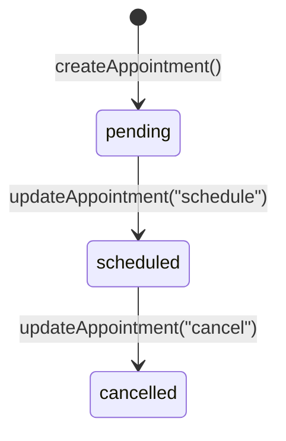

# Appointment Feature – End-to-End Flow

> _This document traces how an appointment request travels through the application—all the pages, components, server actions, and database models involved.  It replaces the older draft that was removed from the repo._

---

## 1. Public Entry → Patient On-Boarding

| Step | File | Key Points |
|------|------|------------|
| **/appointment** | `src/app/appointment/page.tsx` | • Server component.<br>• Calls `auth()` (from `src/auth.ts`).<br>• Redirects unauthenticated users to `/login?callbackUrl=/appointment`.<br>• Shows `<PatientForm />`. |
| Patient form | `src/components/forms/PatientForm.tsx` | • RHF + Zod (`UserFormValidation`).<br>• Calls server action `createUser` (`src/lib/actions/patient.actions.ts`).<br>• On success `router.push(/patients/[uid]/register)`. |

---

## 2. Detailed Patient Registration

| Route | File | Details |
|-------|------|---------|
| **/patients/[userId]/register** | `src/app/patients/[userId]/register/page.tsx` | • Loads `User` & checks `Patient` via `getPatient`.<br>• If patient already exists, redirects to new-appointment.<br>• Otherwise renders `<RegisterForm />`. |
| Register form | `src/components/forms/RegisterForm.tsx` | • Huge form using `PatientFormValidation` (Zod).<br>• Optional file upload via `saveFile()` helper.<br>• Server action `registerPatient` (`src/lib/actions/patient.ts`).<br>• On success ➜ `/patients/[uid]/new-appointment`. |

---

## 3. Patient Requests an Appointment  
*(initial status `pending`)*

| Route | File | Highlights |
|-------|------|-----------|
| **/patients/[userId]/new-appointment** | `src/app/patients/[userId]/new-appointment/page.tsx` | Renders `<AppointmentForm type="create" />`. |
| Appointment form | `src/components/forms/AppointmentForm.tsx` | • Supports `create`, `schedule`, `cancel` modes.<br>• Validation chosen by `getAppointmentSchema(type)` in `src/lib/validation.ts`.<br>• **create** → `createAppointment()` → DB row (`Status.pending`).<br>• Redirect → `/patients/[uid]/new-appointment/success?appointmentId=...`. |
| Success page | `src/app/patients/[userId]/new-appointment/success/page.tsx` | • Fetches appointment by ID.<br>• Displays doctor + date.<br>• Offers link to make another appointment. |

---

## 4. Admin Dashboard – Managing Lifecycle

| Route | File | Purpose |
|-------|------|---------|
| **/admin** | `src/app/admin/page.tsx` | • Calls `getRecentAppointmentList()` to obtain counts + list.<br>• Renders summary `StatCard` trio and `<DataTable />`. |
| DataTable columns | `src/components/table/columns.tsx` | • Custom cells: `StatusBadge`, doctor avatar, etc.<br>• **Actions** cell embeds two `<AppointmentModal />` instances—`schedule` & `cancel`. |
| Appointment modal | `src/components/AppointmentModal.tsx` | • ShadCN `<Dialog>` wrapper around `AppointmentForm` in `schedule` / `cancel` mode. |

### Schedule / Cancel Flow
*File:* `src/lib/actions/appointment.actions.ts`

```ts
updateAppointment({ appointmentId, type, ... })
```
1. Updates record (status + schedule or cancellationReason).
2. Formats date via `formatDateTime`.
3. Sends mail with `sendEmailNotification()` (`src/lib/appo-mail.ts`).
4. `revalidatePath("/admin")` → dashboard regenerates.

---

## 5. Server Actions & Helpers

| File | Role |
|------|------|
| `src/lib/actions/appointment.actions.ts` | `createAppointment`, `updateAppointment`, `getAppointment`, `getRecentAppointmentList`. |
| `src/lib/validation.ts` | Zod schemas (Create / Schedule / Cancel) and `getAppointmentSchema()`. |
| `src/lib/appo-mail.ts` | Resend email helpers (2FA, password reset, **appointment notifications**). |
| `src/lib/utils.ts` | `formatDateTime`, misc helpers. |
| `src/lib/actions/patient.*` | Creation & retrieval of `Patient` and basic `User`. |

---

## 6. Database Models (Prisma)

```prisma
model Appointment {
  id                 String   @id @default(cuid())
  patientId          String
  patient            Patient  @relation("PatientAppointments")
  userId             String
  user               User     @relation("UserAppointments")
  schedule           DateTime
  status             Status   // pending | scheduled | cancelled
  primaryPhysician   String
  reason             String
  note               String
  cancellationReason String?
  createdAt          DateTime @default(now())
  updatedAt          DateTime @updatedAt
}
```
> The model links to both **Patient** and **User**, letting the platform know who requested the appointment and which patient profile it concerns.

---

## 7. Authentication Touch-Points

* `auth()` used in `/appointment` entry page; denies anonymous access.
* Admin dashboard should be role-protected with `RoleGate` or middleware (not detailed here).
* Server actions receive `userId` from the authenticated session—no raw cookies.

---

## 8. Current Directory Map (pre-refactor)

```text
src/
  app/
    appointment/
      page.tsx
    patients/
      [userId]/
        register/
          page.tsx
        new-appointment/
          page.tsx
          success/page.tsx
    admin/page.tsx
  components/
    forms/
      PatientForm.tsx
      RegisterForm.tsx
      AppointmentForm.tsx
    AppointmentModal.tsx
    StatCard.tsx
    StatusBadge.tsx
    SubmitButton.tsx
    table/columns.tsx
  lib/
    actions/
      appointment.actions.ts
      patient.actions.ts
      patient.ts
      type.ts
    appo-mail.ts
    utils.ts
    validation.ts
  prisma/schema.prisma
```

---

## 9. State Transitions Overview


*Emails* are dispatched on the `scheduled` and `cancelled` transitions.

---

## 10. Big-Picture Flow Recap
```
User ➜ /appointment                       (auth guard)
      ➜ PatientForm ➜ createUser()
      ➜ /patients/[uid]/register
      ➜ RegisterForm ➜ registerPatient()
      ➜ /patients/[uid]/new-appointment
      ➜ AppointmentForm(create) ➜ createAppointment(pending)
      ➜ /success
Admin ➜ /admin                            (Role: ADMIN)
      ➜ AppointmentModal(schedule/cancel)
      ➜ updateAppointment() → status change + email + revalidatePath
```

---

✅  That covers the complete appointment journey in the existing code-base. 

---

## 11. Production-Readiness Checklist

Below is a pragmatic list of items to address before shipping the appointment flow to production.

### Security & Privacy
- **HTTPS everywhere** – enforce `https://` and set `NEXTAUTH_URL` to the secure origin.
- **Environment variables** – store all secrets (DB URL, Resend API key, NextAuth providers) in a secret manager (e.g.
  Vercel / AWS Secrets Manager) – never commit them.
- **CSRF & XSS** – NextAuth is configured (`auth.ts`) but confirm the `cookies.sessionToken` settings meet the deployment CDN's requirements (e.g. `sameSite="lax"`, `secure=true`).
- **RBAC** – ensure only `ADMIN` users can reach `/admin`; wrap with `<RoleGate role="ADMIN"/>` or an auth-only middleware.
- **Rate-limit** appointment actions & email endpoints (`/api/…`) to mitigate spam.
- **Data retention / GDPR** – document how patient data and uploaded ID docs are stored, encrypted and deleted.

### Reliability & Observability
- **Validation hardening** – expand Zod schemas to prevent unrealistic dates (e.g. past schedule, 200-char name, etc.).
- **Typed Prisma** – run `prisma generate` in CI to keep the client in sync.
- **Centralised error logging** – pipe `console.error` to Sentry / Logtail; add try/catch around *all* server actions.
- **Health checks** – add `/api/healthz` and optionally database connectivity probe.
- **Monitoring** – set up uptime + performance dashboards (Vercel Analytics, Datadog, etc.).

### Performance & UX
- **Image optimisation** – serve doctor images via `next/image` + remotePatterns or move them to a CDN bucket.
- **Incremental static regeneration (ISR)** – the admin page currently uses `revalidatePath`; verify this works with your hosting platform's cache.
- **Pagination / virtualisation** – DataTable could paginate once appointment volume grows.
- **Optimistic UI** – use `useTransition` or TanStack Query mutations for instant feedback on schedule/cancel.

### Email & Notifications
- **Domain verification** – verify DKIM/SPF for the `no-reply@databayt.org` sender to avoid spam folders.
- **Retry / bounce handling** – log failed Resend sends and surface in admin UI.
- **Appointment reminders** – add a cron job (e.g. Vercel Cron) to email patients 24 h before `schedule`.

### Testing
- **Unit tests** – Jest/Vitest for server actions and validators.
- **Integration tests** – Playwright scripts for patient ➜ register ➜ book ➜ admin schedule/cancel.
- **Load tests** – hit the booking API with realistic traffic bursts.

### DevOps & CI/CD
- **CI gates** – lint (`pnpm lint`), type-check (`pnpm tsc`), test (`pnpm test`), build (`pnpm build`).
- **Database migrations** – use `prisma migrate deploy` in production pipeline; enable backups.
- **Blue/Green / Canary** – optional for zero-downtime deploys when touching Prisma schema.

### Documentation
- Update `README.md`, `INTEGRATION_GUIDE.md`, and API reference with environment variables, cron jobs, and disaster recovery steps.

> Completing the above will harden the appointment flow for real patients and administrators in production. 