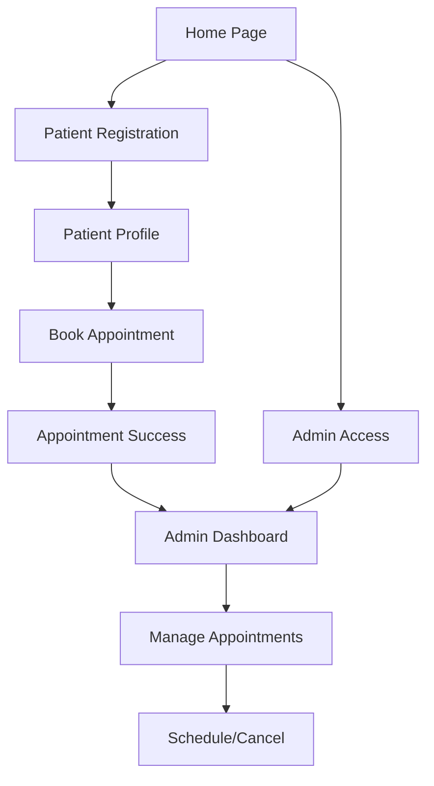

# 🏥 Shifa Healthcare - Appointment Management Flow

This document traces the complete appointment flow in the Shifa Healthcare application, showing how patients book appointments and how admins manage them.

## 📊 System Architecture Overview



## 🔄 Complete User Journey

### 1. **Entry Points**

#### **Main Site** (`/`)
- **File**: `src/app/(site)/page.tsx`
- **Purpose**: Landing page with hero section and feature cards
- **Components**: Hero, FeatureCards, ParallaxText, ImageCSS
- **Next Step**: Users navigate to `/appointment` to start booking

#### **Appointment Portal** (`/appointment`)
- **File**: `src/app/appointment/page.tsx`
- **Purpose**: Main appointment booking entry point
- **Features**:
  - Patient form for initial information
  - Admin access link (`/?admin=true`)
  - PasskeyModal for admin authentication

---

### 2. **Patient Flow** 👥

#### **Step 1: Initial Patient Information** (`/appointment`)
```typescript
// What happens:
1. Patient fills out PatientForm with basic info
2. System creates User record
3. Redirects to patient registration
```

#### **Step 2: Patient Registration** (`/patients/[userId]/register`)
- **File**: `src/app/patients/[userId]/register/page.tsx`
- **Purpose**: Complete patient profile with medical information
- **Process**:
  ```typescript
  const user = await getUser(userId);
  const patient = await getPatient(userId);
  
  if (!user) redirect("/404");
  if (patient) redirect(`/patients/${userId}/new-appointment`);
  ```
- **Form**: `RegisterForm` component with detailed medical info
- **Next Step**: Redirect to appointment booking

#### **Step 3: Book New Appointment** (`/patients/[userId]/new-appointment`)
- **File**: `src/app/patients/[userId]/new-appointment/page.tsx`
- **Purpose**: Book a new appointment with selected doctor
- **Process**:
  ```typescript
  const patient = await getPatient(userId);
  // Render AppointmentForm with patient data
  ```
- **Form**: `AppointmentForm` with doctor selection, date/time, reason

#### **Step 4: Appointment Success** (`/patients/[userId]/new-appointment/success`)
- **File**: `src/app/patients/[userId]/new-appointment/success/page.tsx`
- **Purpose**: Confirmation page with appointment details
- **Features**:
  - Success animation (GIF)
  - Appointment details display
  - Doctor information with photo
  - "New Appointment" button for additional bookings

---

### 3. **Admin Flow** 👨‍⚕️

#### **Admin Access** (`/?admin=true`)
- **Trigger**: Admin link from appointment page
- **Authentication**: PasskeyModal popup
- **Default Passkey**: `112233` (configurable via `NEXT_PUBLIC_ADMIN_PASSKEY`)

#### **Admin Dashboard** (`/admin`)
- **File**: `src/app/admin/page.tsx`
- **Purpose**: Central management hub for all appointments
- **Features**:
  - **Statistics Cards**:
    - Scheduled appointments count
    - Pending appointments count
    - Cancelled appointments count
  - **Data Table** with appointment list
  - **Actions**: Schedule/Cancel appointments via modals

---

## 📋 Data Models & Relationships

### **Database Schema**
```prisma
User {
  id          String
  name        String?
  email       String?
  phone       String?
  patients    Patient[]
  appointments Appointment[]
}

Patient {
  id                     String
  userId                 String
  name                   String
  email                  String
  phone                  String
  birthDate              DateTime
  gender                 Gender
  address                String
  occupation             String
  emergencyContactName   String
  emergencyContactNumber String
  primaryPhysician       String
  insuranceProvider      String
  insurancePolicyNumber  String
  allergies              String?
  currentMedication      String?
  appointments           Appointment[]
}

Appointment {
  id                 String
  patientId          String
  userId             String
  schedule           DateTime
  status             Status (pending/scheduled/cancelled)
  primaryPhysician   String
  reason             String
  note               String
  cancellationReason String?
}
```

## 🎯 Key Components

### **Forms**
- **`PatientForm`**: Initial patient information collection
- **`RegisterForm`**: Complete patient registration with medical details
- **`AppointmentForm`**: Appointment booking with doctor/time selection

### **Admin Components**
- **`DataTable`**: Displays appointments with sorting/pagination
- **`StatCard`**: Shows appointment statistics
- **`AppointmentModal`**: Schedule/cancel appointment actions
- **`PasskeyModal`**: Admin authentication

### **UI Components**
- **`StatusBadge`**: Visual status indicators (pending/scheduled/cancelled)
- **Tables, Forms, Buttons**: Shadcn UI components

---

## 🔐 Security & Authentication

### **Admin Access**
- Environment variable: `NEXT_PUBLIC_ADMIN_PASSKEY`
- Default: `112233`
- Encrypted storage in localStorage
- Automatic redirect on invalid access

### **Data Protection**
- Patient data encrypted
- Secure database connections
- Privacy consent tracking

---

## 🚀 API Endpoints & Actions

### **Patient Actions** (`src/lib/actions/patient.actions.ts`)
```typescript
createUser(userData)        // Create new user
getUser(userId)            // Fetch user by ID
getPatient(userId)         // Fetch patient by user ID
registerPatient(patientData) // Register new patient
```

### **Appointment Actions** (`src/lib/actions/appointment.actions.ts`)
```typescript
createAppointment(appointmentData)     // Book new appointment
getRecentAppointmentList()             // Get all appointments for admin
updateAppointment({appointmentId, ...}) // Schedule/cancel appointment
getAppointment(appointmentId)          // Get specific appointment
```

---

## 📱 User Experience Flow

### **Patient Journey**
1. **Discovery**: Land on home page → Learn about services
2. **Entry**: Click "Book Appointment" → `/appointment`
3. **Registration**: Fill basic info → Create account → `/patients/[userId]/register`
4. **Profile**: Complete medical information → Submit registration
5. **Booking**: Select doctor, date, reason → `/patients/[userId]/new-appointment`
6. **Confirmation**: View success page → `/patients/[userId]/new-appointment/success`

### **Admin Journey**
1. **Access**: Click "Admin" link → Enter passkey
2. **Dashboard**: View statistics → `/admin`
3. **Management**: Review appointment list → Schedule/cancel appointments
4. **Communication**: System sends email notifications automatically

---

## 🛠️ Technical Implementation

### **Routing Structure**
```
/                                    # Main landing page
/appointment                        # Patient entry point
/patients/[userId]/register         # Patient registration
/patients/[userId]/new-appointment  # Appointment booking
/patients/[userId]/new-appointment/success # Confirmation
/admin                             # Admin dashboard
```

### **State Management**
- Server-side data fetching with Next.js App Router
- Form state managed by React Hook Form
- Database operations via Prisma ORM

### **Styling**
- Tailwind CSS for responsive design
- Shadcn UI component library
- Custom animations and transitions

---

## 🔧 Configuration

### **Environment Variables**
```bash
# Admin access
NEXT_PUBLIC_ADMIN_PASSKEY=112233

# Database
DATABASE_URL="postgresql://..."

# Authentication
NEXTAUTH_SECRET="your-secret"
NEXTAUTH_URL="http://localhost:3000"

# Email notifications
RESEND_API_KEY="your-api-key"
```

### **Doctor Configuration**
Update `src/constants/index.ts` to add/modify available doctors:
```typescript
export const Doctors = [
  {
    image: "/assets/images/dr-green.png",
    name: "John Green",
  },
  // Add more doctors...
];
```

---

## 📧 Notifications

### **Email System**
- **Library**: Resend API
- **Triggers**: 
  - Appointment scheduled
  - Appointment cancelled
- **Templates**: Dynamic with appointment details
- **Recipients**: Patient email from registration

---

## 🐛 Troubleshooting

### **Common Issues**

1. **"Cannot read properties of undefined (reading 'findMany')"**
   - **Cause**: Prisma client not generated
   - **Fix**: Run `pnpm prisma generate`

2. **"searchParams should be awaited"**
   - **Cause**: Next.js 15 async searchParams
   - **Fix**: Use `await searchParams` in components

3. **Admin passkey not working**
   - **Cause**: Environment variable not set
   - **Fix**: Set `NEXT_PUBLIC_ADMIN_PASSKEY` in environment

4. **Infinite redirect loop to login**
   - **Cause**: Middleware not recognizing dynamic routes as public
   - **Fix**: Updated middleware to handle wildcard routes (`/patients/*/register`)

5. **Edge Runtime errors**
   - **Cause**: Node.js modules in Edge Runtime
   - **Fix**: Simplified database configuration, removed Node.js specific imports

6. **Logo not found error**
   - **Cause**: Incorrect image path
   - **Fix**: Updated to use correct asset path `/assets/icons/logo-icon.svg`

7. **"Invalid User ID format" error**
   - **Cause**: MongoDB-specific validation expecting 24-character ObjectIds, but PostgreSQL uses cuid()
   - **Fix**: Updated validation in `getUser()` and `getPatient()` functions to accept variable-length IDs

8. **"params should be awaited" error**
   - **Cause**: Next.js 15 requires awaiting dynamic params and searchParams
   - **Fix**: Updated all dynamic route pages to properly await params

9. **Missing dependencies for file upload**
   - **Cause**: `react-dropzone`, `cloudinary`, `streamifier` not installed
   - **Fix**: Installed missing packages with `pnpm add react-dropzone cloudinary streamifier @types/streamifier`

---

## 📈 Future Enhancements

- [ ] Real-time appointment notifications
- [ ] Calendar integration
- [ ] Multiple appointment types
- [ ] Doctor availability management
- [ ] Patient history tracking
- [ ] SMS notifications
- [ ] Payment integration
- [ ] Telemedicine support

---

## 🚀 Getting Started

1. **Install dependencies**: `pnpm install`
2. **Set up database**: Configure `DATABASE_URL`
3. **Generate Prisma client**: `pnpm prisma generate`
4. **Push schema**: `pnpm prisma db push`
5. **Start development**: `pnpm dev`
6. **Access admin**: Go to `/?admin=true` (passkey: `112233`)

---

*This documentation provides a complete overview of the appointment management system. For technical support or feature requests, please refer to the development team.* 