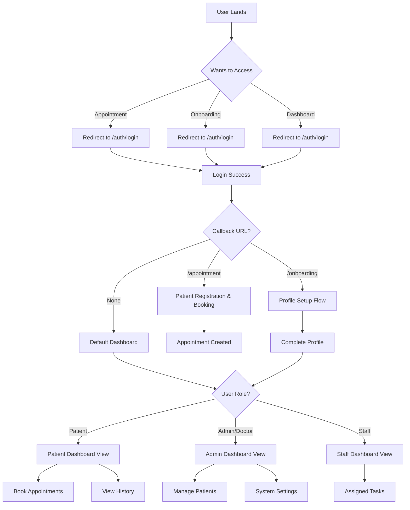

# 🏥 Healthcare App Integration Guide

## Overview

This document outlines the optimal integration strategy for the reusable blocks in your healthcare application. The project currently has several distinct blocks that need proper integration:

- **Auth Block** (`@/(auth)`) - User authentication system
- **Appointment Block** (`@/appointment`) - Public appointment booking
- **Onboarding Block** (`@/onboarding`) - User onboarding flow
- **Profile Block** (`@/dashboard/profile`) - User profile management
- **Patients Block** (`@/patients`) - Patient management system

## 🚨 Current Issues Identified

### 1. **Dual Auth Systems**
- **Primary Auth**: `@/(auth)` - Complete authentication system with login, register, reset, etc.
- **Secondary Auth**: `@/appointment` - Basic patient form with passkey modal for admin access
- **Problem**: Confusion between two different auth flows

### 2. **Redirect Loop to Appointment**
- Middleware redirects unauthenticated users to `/appointment` instead of login
- `DEFAULT_LOGIN_REDIRECT` points to `/auth/setting` which may not exist
- Inconsistent redirect behavior between blocks

### 3. **Route Configuration Conflicts**
- Public routes include both auth and appointment paths
- Platform routes not properly protected
- Missing proper redirect flows between blocks

## 🎯 Recommended Integration Strategy

### Phase 1: Centralize Authentication with `@/(auth)`

#### 1.1 Define Clear Auth Boundaries

```typescript
// src/routes.ts - Updated configuration
export const publicRoutes = [
  "/",                  // Landing page only
  "/doctors",           // Public doctor listing
  "/departments",       // Public department info
  "/auth/new-verification",
];

export const authRoutes = [
  "/auth/login",
  "/auth/join", 
  "/auth/error",
  "/auth/reset",
  "/auth/new-password"
];

// Protected routes that require authentication
export const protectedRoutes = [
  "/appointment",       // Protected appointment booking
  "/onboarding",        // Protected onboarding flow
  "/dashboard",         // Protected dashboard
  "/patients",          // Protected patient management
  "/admin"              // Protected admin functionality
];

// Dynamic redirect based on callback URL
export const DEFAULT_LOGIN_REDIRECT = "/dashboard";
```

#### 1.2 Centralized Auth Flow Design



### Phase 2: Restructure Application Flow

#### 2.1 Centralized Entry Point Strategy

```typescript
// All Protected Routes Flow
1. User navigates to any protected route ("/appointment", "/onboarding", "/dashboard")
   ↓
2. Middleware checks authentication
   ↓
3. If not authenticated → Redirect to "/auth/login?callbackUrl=originalRoute"
   ↓
4. User completes authentication
   ↓
5. Redirect back to original route (callbackUrl)

// Specific Route Behaviors After Auth:
- "/appointment" → Patient registration form + appointment booking
- "/onboarding" → Profile completion flow
- "/dashboard" → Role-based dashboard view
```

#### 2.2 Update Middleware Logic

```typescript
// src/middleware.ts - Centralized auth protection
export default auth((req) => {
  const { nextUrl } = req
  const isLoggedIn = !!req.auth
  const pathname = nextUrl.pathname

  // API routes - always allow
  if (pathname.startsWith(apiAuthPrefix)) {
    return
  }

  // Auth routes - redirect if already logged in
  if (authRoutes.includes(pathname)) {
    if (isLoggedIn) {
      const callbackUrl = nextUrl.searchParams.get("callbackUrl")
      return Response.redirect(new URL(callbackUrl || DEFAULT_LOGIN_REDIRECT, nextUrl))
    }
    return
  }

  // Public routes - always allow
  if (publicRoutes.includes(pathname)) {
    return
  }

  // All other routes require authentication
  if (!isLoggedIn) {
    const callbackUrl = pathname + nextUrl.search
    const encodedCallbackUrl = encodeURIComponent(callbackUrl)
    return Response.redirect(new URL(`/auth/login?callbackUrl=${encodedCallbackUrl}`, nextUrl))
  }

  // Authenticated - allow access
  return
})
```

### Phase 3: Block Integration Patterns

#### 3.1 Auth Block (`@/(auth)`)

**Purpose**: Complete authentication system for registered users
**Integration Points**:
- Entry point for returning users
- Admin/doctor login
- Password reset flows
- Two-factor authentication

**Recommended Changes**:
```typescript
// Update DEFAULT_LOGIN_REDIRECT
export const DEFAULT_LOGIN_REDIRECT = "/dashboard";

// Add user role checking after login
// Redirect to onboarding if profile incomplete
```

#### 3.2 Appointment Block (`@/appointment`)

**Purpose**: Protected appointment booking and patient registration
**Integration Points**:
- Requires authentication first
- Handles patient registration within the same flow
- Integrates with user session for personalized experience

**Recommended Changes**:
```typescript
// Make protected route
// Handle patient registration after auth
// Remove separate patients routes
// Integrate admin functionality through user roles
```

#### 3.3 Patients Block (`@/patients`) - **DEPRECATED**

**Purpose**: ⚠️ **To be integrated into appointment block**
**Migration Plan**:
- Move patient registration logic to `/appointment`
- Integrate patient management into `/dashboard` with admin role
- Remove separate patient routes
- Consolidate all patient functionality under authenticated routes

**New Flow**:
```
/auth/login?callbackUrl=/appointment → 
/appointment (handles registration + booking) → 
/dashboard (manages appointments based on role)
```

#### 3.4 Onboarding Block (`@/onboarding`)

**Purpose**: Complete user profile setup for authenticated users
**Integration Points**:
- Post-authentication flow for incomplete profiles
- Professional information gathering
- Platform access preparation

**Recommended Changes**:
```typescript
// Trigger after auth login if profile incomplete
// Add skip options for basic users
// Clear progress indicators
// Direct path to dashboard upon completion
```

#### 3.5 Profile Block (`@/dashboard/profile`)

**Purpose**: User profile management within platform
**Integration Points**:
- Central hub for user information
- Edit capabilities for onboarded users
- Professional networking features

**Current Implementation** ✅ (Good structure)

### Phase 4: Navigation & User Experience

#### 4.1 Unified Navigation Strategy

```typescript
// Navigation Component Logic
const getNavigationItems = (user, userRole) => {
  const baseItems = [
    { href: "/", label: "Home" },
    { href: "/appointment", label: "Book Appointment" },
    { href: "/doctors", label: "Our Doctors" },
    { href: "/departments", label: "Departments" }
  ];

  if (!user) {
    return [...baseItems, { href: "/auth/login", label: "Login" }];
  }

  const authenticatedItems = [
    { href: "/dashboard", label: "Dashboard" },
    { href: "/dashboard/profile", label: "Profile" }
  ];

  if (userRole === 'admin' || userRole === 'doctor') {
    authenticatedItems.push(
      { href: "/admin", label: "Admin Panel" },
      { href: "/dashboard/membership", label: "Manage Patients" }
    );
  }

  return [...baseItems, ...authenticatedItems];
};
```

#### 4.2 Smart Redirects

```typescript
// Smart redirect logic based on user state
const getRedirectPath = (user, pathname) => {
  // New user or incomplete profile
  if (user && !user.profileComplete) {
    return "/onboarding";
  }
  
  // Authenticated user accessing public pages
  if (user && publicRoutes.includes(pathname)) {
    return "/dashboard";
  }
  
  // Unauthenticated user accessing protected pages
  if (!user && protectedRoutes.includes(pathname)) {
    return "/auth/login";
  }
  
  return pathname;
};
```

## 🔧 Implementation Steps

### Step 1: Update Route Configuration
1. ✅ Update `src/routes.ts` with clear route definitions
2. ✅ Modify `DEFAULT_LOGIN_REDIRECT` to `/dashboard`
3. ✅ Review and update `publicRoutes` array

### Step 2: Fix Middleware
1. ✅ Update middleware logic to handle healthcare-specific flows
2. ✅ Remove appointment redirect for authenticated users
3. ✅ Add proper platform route protection

### Step 3: Integrate Auth Flow
1. ✅ Add profile completion check after login
2. ✅ Redirect incomplete profiles to onboarding
3. ✅ Ensure proper role-based access

### Step 4: Enhance User Experience
1. ✅ Add clear navigation between blocks
2. ✅ Implement progress indicators in onboarding
3. ✅ Add user state awareness in components

### Step 5: Testing & Validation
1. ✅ Test each user journey end-to-end
2. ✅ Validate redirect logic
3. ✅ Ensure no auth conflicts

## 📱 User Journey Examples

### New Patient Journey
```
1. Navigates to "/appointment"
2. Redirected to "/auth/login?callbackUrl=/appointment"
3. Completes authentication (login/register)
4. Redirected back to "/appointment"
5. Completes patient registration + appointment booking
6. Success confirmation
```

### Returning User Journey
```
1. Navigates to any protected route
2. If authenticated → direct access
3. If not authenticated → login flow with callback
4. Access route after authentication
```

### Admin/Doctor Journey
```
1. Login through "/auth/login"
2. Access "/dashboard" with admin/doctor role
3. Role-based UI shows admin capabilities
4. Manage patients, appointments, system settings
```

## ⚡ Quick Fixes for Immediate Issues

### Fix 1: Centralize Auth Protection
```typescript
// In middleware.ts: Protect all routes except public ones
if (!isLoggedIn && !publicRoutes.includes(pathname) && !authRoutes.includes(pathname)) {
  const callbackUrl = pathname + nextUrl.search
  const encodedCallbackUrl = encodeURIComponent(callbackUrl)
  return Response.redirect(new URL(`/auth/login?callbackUrl=${encodedCallbackUrl}`, nextUrl))
}
```

### Fix 2: Update Routes Configuration
```typescript
// In routes.ts: Simplify to public routes only
export const publicRoutes = ["/", "/doctors", "/departments", "/auth/new-verification"];
export const DEFAULT_LOGIN_REDIRECT = "/dashboard";
```

### Fix 3: Handle Callback URLs in Auth
```typescript
// In auth login action: Support callback URLs
const callbackUrl = searchParams.get("callbackUrl")
await signIn("credentials", {
  email,
  password,
  redirectTo: callbackUrl || DEFAULT_LOGIN_REDIRECT,
})
```

## 🎨 UI/UX Considerations

### Visual Consistency
- Use consistent styling across all blocks
- Maintain shadcn/ui design system
- Ensure responsive design for all flows

### Progress Indicators
- Show completion status in onboarding
- Clear navigation breadcrumbs
- User state awareness in headers

### Error Handling
- Graceful auth error handling
- Clear error messages for users
- Fallback routes for edge cases

## 🔮 Future Enhancements

1. **Multi-tenant Support**: Separate hospital/clinic instances
2. **Advanced Role Management**: Granular permissions system
3. **Patient Portal**: Dedicated patient dashboard
4. **Appointment Management**: Advanced scheduling features
5. **Notification System**: Real-time updates and reminders

---

**Note**: This integration guide provides a roadmap for consolidating your reusable blocks into a cohesive healthcare application. Implement changes incrementally and test each phase thoroughly before proceeding to the next. 